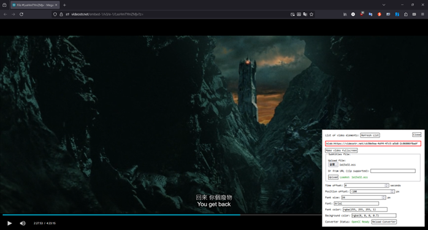

# 新增字幕擴充套件

一個簡單但功能強大的 Firefox 瀏覽器擴充套件，讓您可以為網頁上的任何 `<video>` 元素新增外部字幕檔案。

## 專案說明
本專案是基於原始 add-subtitles 進行修復及優化的版本。主要修改包括：
- 新增支援 ASS/SSA 字幕格式
- 自動簡體中文轉繁體中文
- 修復全螢幕播放

## 功能特色
- 支援 SRT、VTT、ASS/SSA 字幕格式
- 支援 ZIP 壓縮檔中的字幕
- 自動簡體中文轉繁體中文
- 可調整字幕位置、大小和顏色
- 支援全螢幕播放
- 鍵盤快捷鍵控制

## 第三方函式庫聲明

本擴充套件使用了以下第三方函式庫。完整資訊請參閱 [THIRD_PARTY_LIBRARIES.md](THIRD_PARTY_LIBRARIES.md)：

### JSZip v3.3.0
- **用途**：處理 ZIP 壓縮檔中的字幕檔案
- **來源**：[官方 GitHub 儲存庫](https://github.com/Stuk/jszip)
- **授權條款**：MIT License
- **版本**：3.3.0（穩定版本）

### OpenCC-JS v1.0.5
- **用途**：簡體中文轉繁體中文
- **來源**：[官方 GitHub 儲存庫](https://github.com/nk2028/opencc-js)
- **授權條款**：MIT License
- **版本**：1.0.5（穩定版本）

## 安裝方式

1. 從 Firefox 附加元件商店安裝（建議）
2. 或下載 `.xpi` 檔案進行手動安裝

## 使用方法

1. 在包含 `<video>` 元素的網頁上點擊擴充套件圖示
2. 選擇要新增字幕的影片元素
3. 上傳字幕檔案或輸入字幕檔案的網址
4. 調整字幕設定（選用）
5. 享受帶有字幕的影片！

## 授權條款

本專案採用 MIT 授權條款。詳細資訊請參閱 [LICENSE](LICENSE) 檔案。
